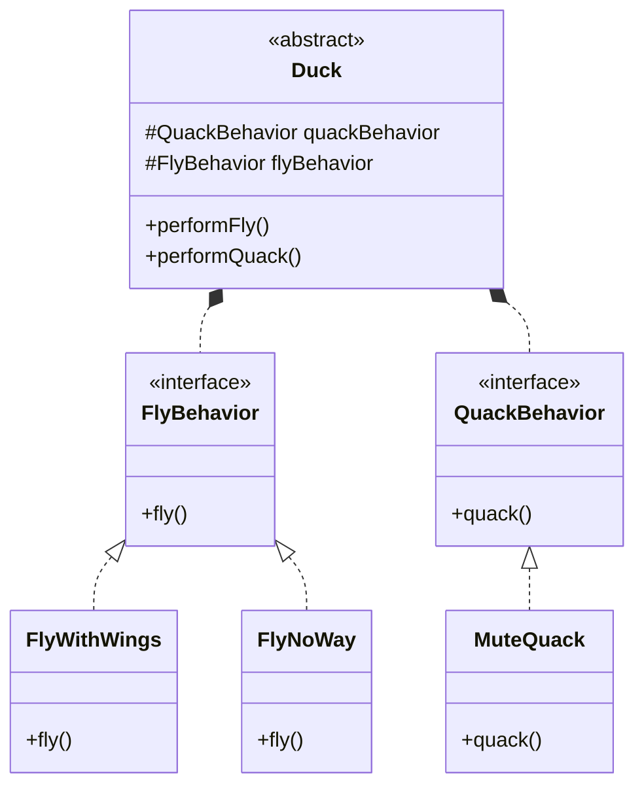
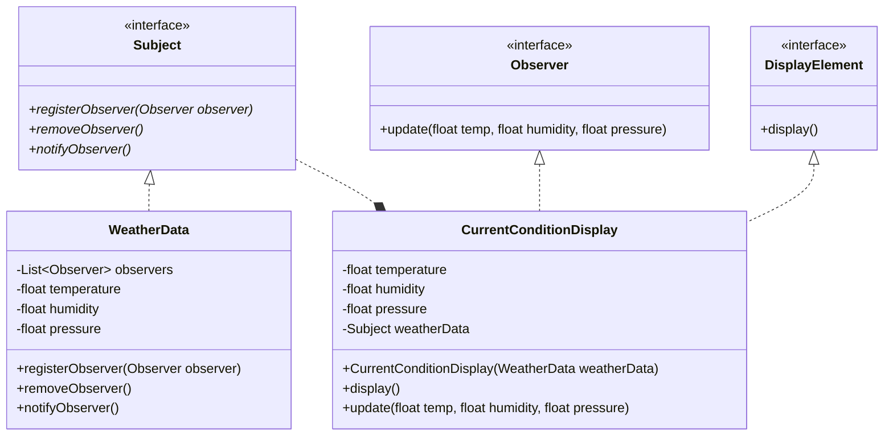
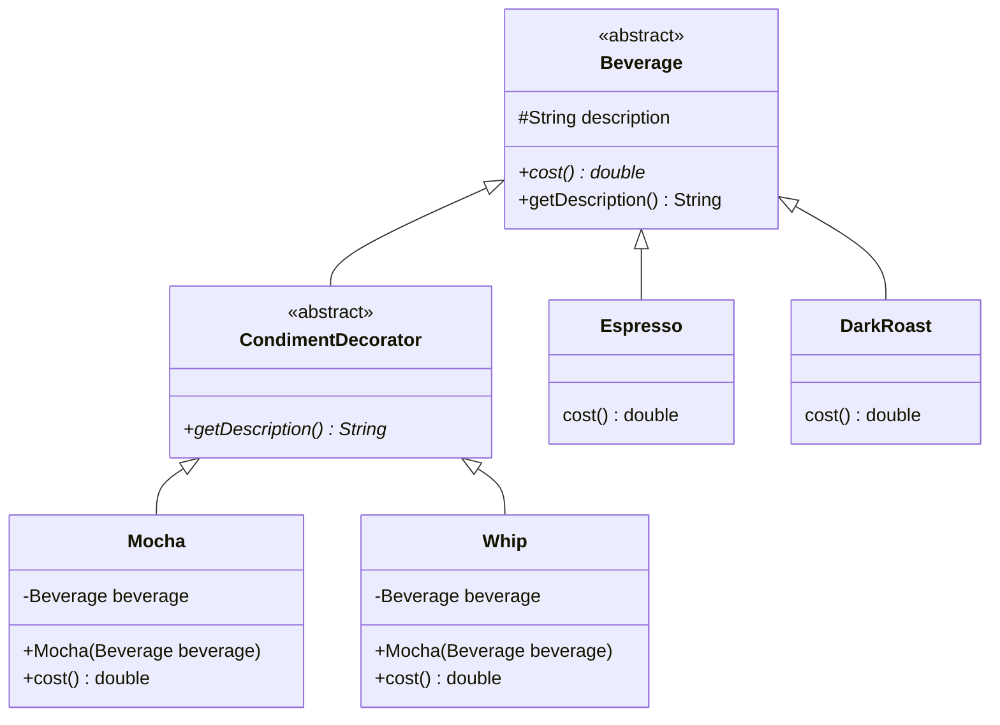
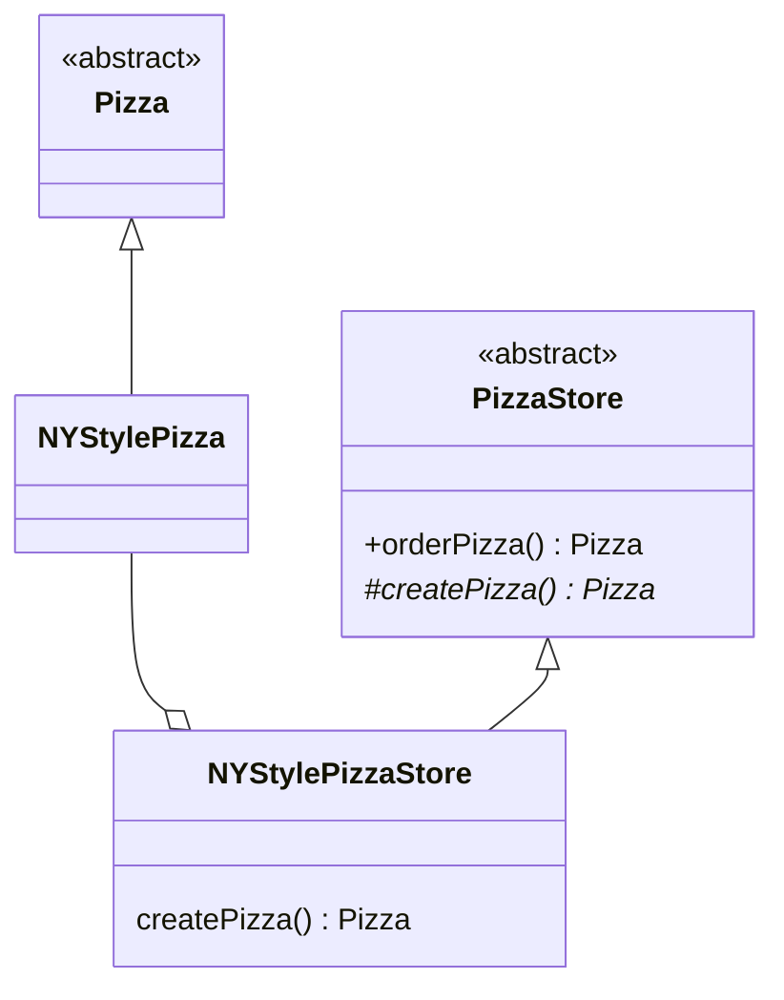
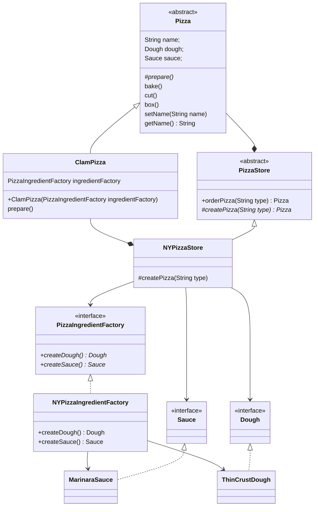
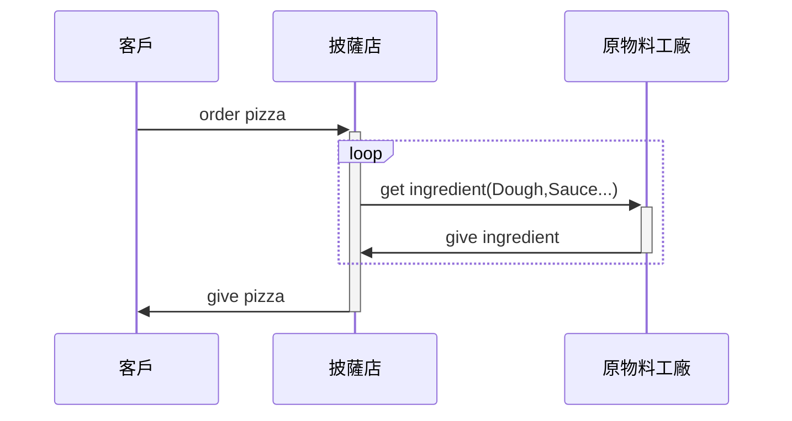
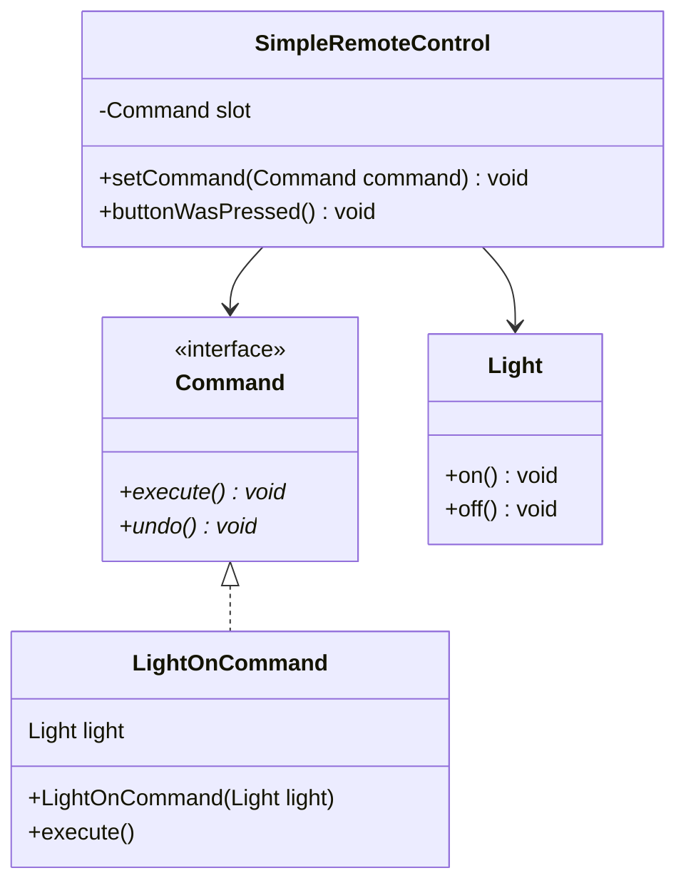

[TOC]

# Design-Patterns-Note

> * 封裝
> * 繼承
> * 多型
> * 抽象

## 策略模式
> Duck 鴨子行為範例
>
> behavior盡量以HAS-A(有一個)，而不是用繼承
>
> Strategy Pattern 策略模式

## 觀察者模式

> Weather 天氣觀測站範例

## 裝飾者模式

> Beverage 飲料販賣範例

## 工廠方法模式

> 於抽象類別定義抽象方法，將實際運作的方式交給次類別實踐

## 抽象工廠模式

> 建立介面、方法回傳的值也皆為介面，由實作物件去實踐這些方法、回傳的實際物件

## 獨體模式(singleton)

> 只能有一個實例

## 命令模式

> 將請求封裝為物件

