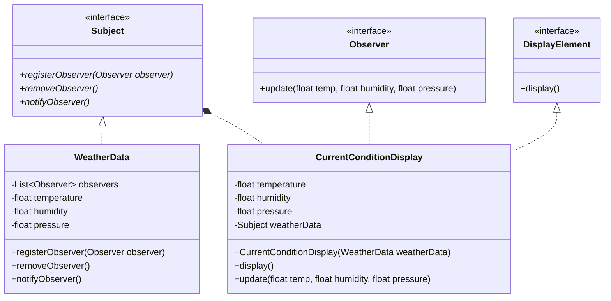
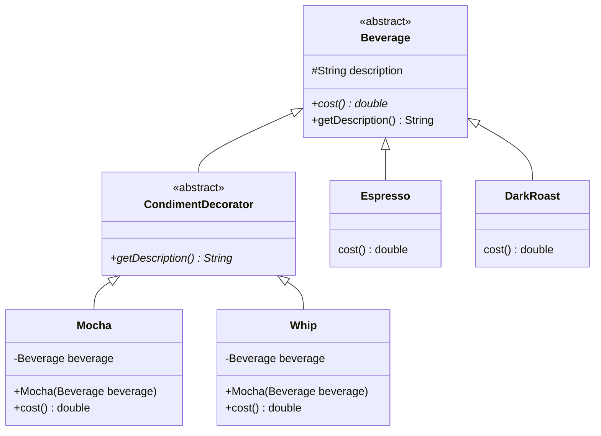

# Design-Patterns-Note

## 策略模式
> Duck 鴨子行為範例
>
> behavior盡量以HAS-A(有一個)，而不是用繼承
>
> Strategy Pattern 策略模式
```java
public abstract class Duck {
  // HAS-A 叫聲 interface
  QuackBehavior quackBehavior;
  // HAS-A 飛行行為 interface
  FlyBehavior flyBehavior;
  // 外觀
  public abstract void display();
  
  // 執行飛行
  public void performFly() {
    quackBehavior.fly();
  }
  
  // 執行叫
  public void performQuack() {
    quackBehavior.quack();
  }
}
```

## 觀察者模式

> Weather 天氣觀測站範例




## 裝飾者模式

> Beverage 飲料販賣範例


