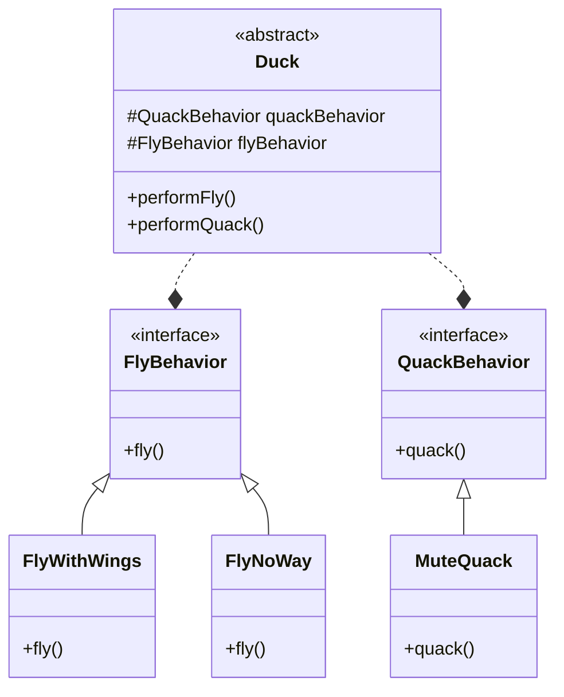
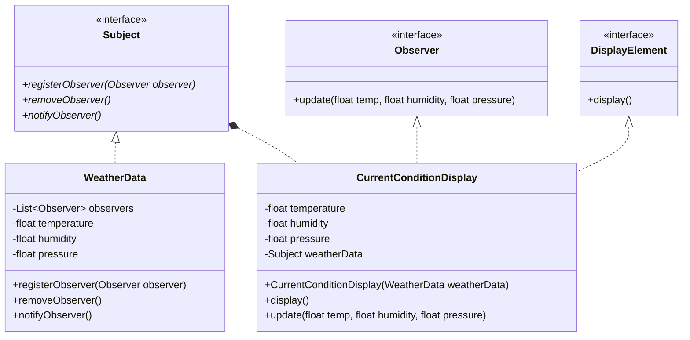
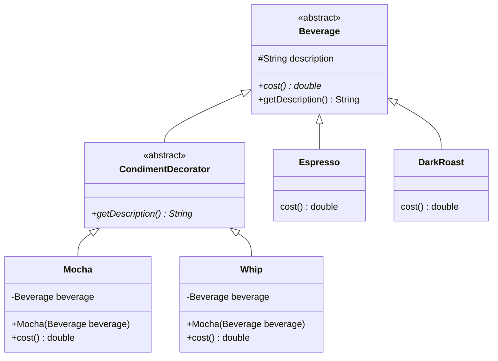
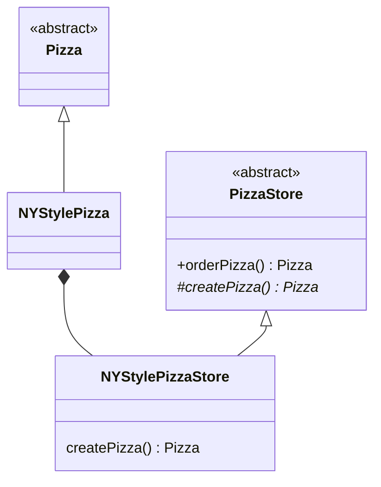

# Design-Patterns-Note

## 策略模式
> Duck 鴨子行為範例
>
> behavior盡量以HAS-A(有一個)，而不是用繼承
>
> Strategy Pattern 策略模式

```mermaid
classDiagram
Duck ..* FlyBehavior
Duck ..* QuackBehavior

class Duck {
 <<abstract>>
 #QuackBehavior quackBehavior
 #FlyBehavior flyBehavior
 +performFly()
 +performQuack()
}
QuackBehavior <|-- MuteQuack
class QuackBehavior {
 <<interface>>
 +quack()
}
class MuteQuack {
 +quack()
}
FlyBehavior <|-- FlyWithWings
FlyBehavior <|-- FlyNoWay
class FlyBehavior {
  <<interface>>
  +fly()
}
class FlyWithWings {
 +fly()
}

class FlyNoWay {
 +fly()
}
```

## 觀察者模式

> Weather 天氣觀測站範例

```mermaid
classDiagram

Subject <|.. WeatherData

class Subject {
	<<interface>>
	+registerObserver(Observer observer)*
	+removeObserver()*
	+notifyObserver()*
}

class WeatherData {
	-List~Observer~ observers
	-float temperature
	-float humidity
	-float pressure
	+registerObserver(Observer observer)
	+removeObserver()
	+notifyObserver()
}

DisplayElement <|.. CurrentConditionDisplay
Observer <|.. CurrentConditionDisplay
Subject *.. CurrentConditionDisplay
class DisplayElement {
	<<interface>>
	+display()
}

class Observer {
	<<interface>>
	+update(float temp, float humidity, float pressure)
}

class CurrentConditionDisplay {
	-float temperature
	-float humidity
	-float pressure
	-Subject weatherData
	+CurrentConditionDisplay(WeatherData weatherData)
	+display()
	+update(float temp, float humidity, float pressure)
}

```

## 裝飾者模式

> Beverage 飲料販賣範例

```mermaid
classDiagram
Beverage <|-- CondimentDecorator
Beverage <|-- Espresso
Beverage <|-- DarkRoast
class Beverage {
 <<abstract>>
 #String description
 +cost()* double
 +getDescription() String
}

class Espresso {
  cost() double
}
class DarkRoast {
	cost() double
}


CondimentDecorator <|-- Mocha
CondimentDecorator <|-- Whip
class CondimentDecorator {
 <<abstract>>
 +getDescription()* String
}

class Mocha {
-Beverage beverage
+Mocha(Beverage beverage)
+cost() double
}
class Whip {
-Beverage beverage
+Mocha(Beverage beverage)
+cost() double
}
```

## 工廠方法模式

```mermaid
classDiagram

NYStylePizza *-- NYStylePizzaStore

class NYStylePizzaStore {
  createPizza() Pizza
}

Pizza <|-- NYStylePizza
class Pizza {
 <<abstract>>
}
class NYStylePizza

PizzaStore <|-- NYStylePizzaStore

class PizzaStore {
 <<abstract>>
 +orderPizza() Pizza
 #createPizza()* Pizza
}

```

## 抽象工廠模式

